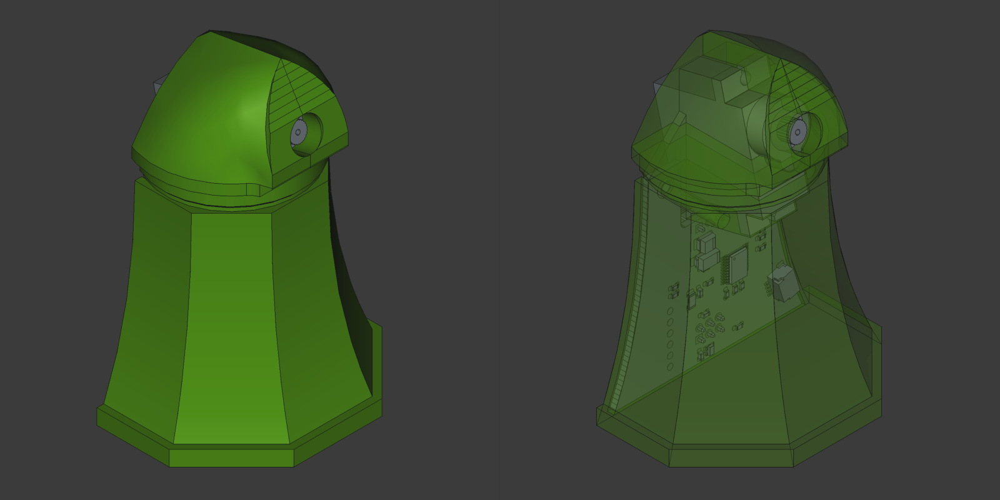
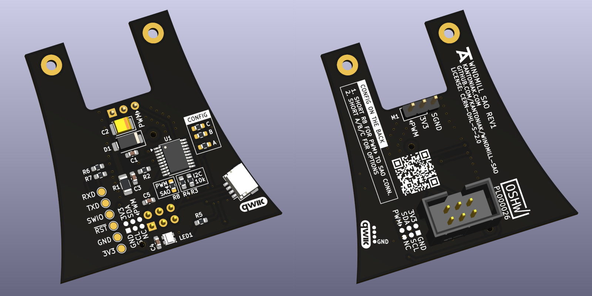

# Windmill SAO

Dutch [tower mill](https://en.wikipedia.org/wiki/Tower_mill) in a [SAO (Simple Add-on/Shitty Add-on)](https://hackaday.io/project/52950-shitty-add-ons/log/159806-introducing-the-shitty-add-on-v169bis-standard) form factor.

The project consists of:
* 3D printed enclosure (see [enclosure/](./enclosure/))
* PCB design (see [hardware/](./hardware/))
* PCB firmware (see [firmware/](./firmware/))

Some components are available in the repository only as scripts that generate resources. See the releases for generated outputs.

## Enclosure

Enclosure is built from a headless Python script that generates a FreeCAD model. Use FreeCAD 1.0 stable.

<p align="center">
  
</p>

### Windows

1. Add FreeCAD's `bin/` directory to `PATH`. Usually `C:\Program Files\FreeCAD 1.0\bin\`
2. Generate the model:

    ```powershell
    cd enclosure/
    freecadcmd model.py
    ```

### Linux

1. Install FreeCAD:

    ```bash
    # Install FreeCAD
    sudo add-apt-repository ppa:freecad-maintainers/freecad-stable
    sudo apt update
    sudo apt install freecad
    ```
2. Generate the model:

    ```powershell
    cd enclosure/
    freecadcmd model.py
    ```

## PCB

The PCB was designed in KiCad. See `hardware/` for the source files and releases for generated outputs.

<p align="center">
  <a href="readme/preview-pcb.png">
    
  </a>
</p>

## Firmware

The PCB is built around CH32V003 and the firmware uses open-source [ch32fun](https://github.com/cnlohr/ch32fun) stack. Use PlatformIO to program the chip.

## License

[Open source hardware project: `[OSHW] PL000026`<br />

](https://certification.oshwa.org/pl000026.html)

This project in its entirety is licensed under the `CERN-OHL-S-2.0` license - see the [LICENSE](LICENSE) file for details.
