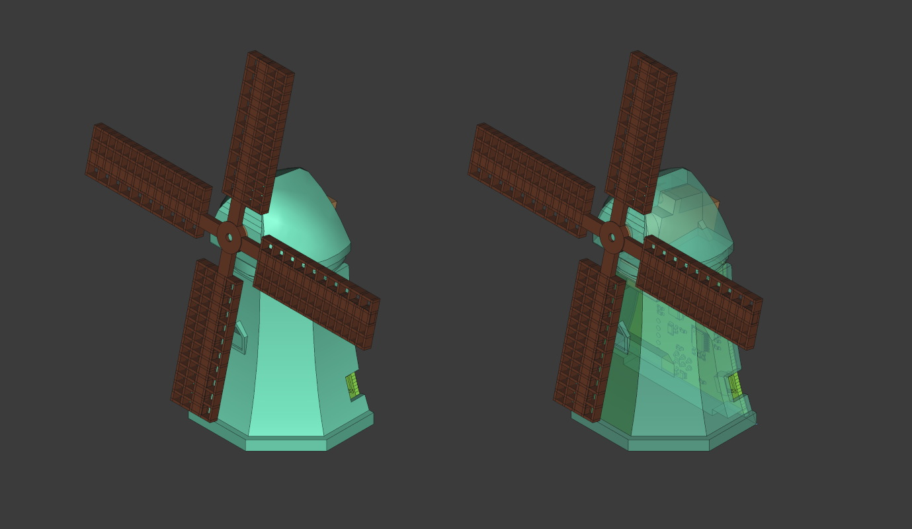

# Windmill SAO

Dutch [tower mill](https://en.wikipedia.org/wiki/Tower_mill) in a [SAO (Simple Add-on/Shitty Add-on)](https://hackaday.io/project/52950-shitty-add-ons/log/159806-introducing-the-shitty-add-on-v169bis-standard) form factor.

The project consists of:
* 3D printed enclosure (see [enclosure/](./enclosure/))
* PCB design (see [hardware/](./hardware/))
* PCB firmware (see [firmware/](./firmware/))

Some components are available in the repository only as scripts that generate resources. See the releases for generated outputs.

## Assembly

It's quick - you only need a Philips screwdriver and light soldering.

> [!IMPORTANT]
> Before starting, check the contents of your kit. I have spares if anything is missing or damaged.
> You should have:
> * 3D‑printed tower with 2 embedded thread inserts
> * 3D‑printed windsail
> * Custom PCB
> * SG‑90 servo kit:
>   * Small bag with silver screws (and servo arms, not used)
>   * Small bag with components:
>     * 2× black M2 screws
>     * 2× 3D‑printed mount pieces (one is extra)
>     * SAO connector + 1×3 0.1" header pins

1. Solder the SAO connector and the 0.1" pins **on the side with the text**.
2. Insert the servo into the tower, **cables pointing up**. When viewed from the back: yellow left, black right.
3. Push the small 3D‑printed coupler onto the servo output shaft.
4. Place the windsail onto the coupler and secure it with the wide‑head silver servo screw.
5. Screw the PCB onto the back of the tower using the black M2 screws.
6. Connect the servo to the board: **yellow to PWM**, **black to SGND**.

> [!TIP]
> The programming pads are on a 0.1" grid for easy access.
> You only need `3V3`, `GND`, and `SWIO`; they are in a straight line.
>
> For flashing, use PlatformIO with the open‑source
> **[minilink](https://github.com/cnlohr/ch32fun/blob/master/minichlink/README.md)** programmer.
> Elliot also wrote a [Pico‑based flasher](https://github.com/hexagon5un/pico_ch32v003_prog/) (not tested by me).


## Enclosure

The enclosure is built from a headless Python script that generates a FreeCAD model. Use FreeCAD 1.0 stable.

<p align="center">
  <a href="readme/preview-enclosure.png">
    
  </a>
</p>

### Windows

1. Add FreeCAD's `bin/` directory to `PATH`. Usually `C:\Program Files\FreeCAD 1.0\bin\`
2. Generate the model:

    ```powershell
    cd enclosure/
    freecadcmd model.py
    ```

### Linux

1. Install FreeCAD:

    ```bash
    # Install FreeCAD
    sudo add-apt-repository ppa:freecad-maintainers/freecad-stable
    sudo apt update
    sudo apt install freecad
    ```
2. Generate the model:

    ```powershell
    cd enclosure/
    freecadcmd model.py
    ```

## PCB

The PCB was designed in KiCad. See `hardware/` for the source files and releases for generated outputs.

<p align="center">
  <a href="readme/preview-pcb.png">
    
  </a>
</p>

## Firmware

The PCB is built around CH32V003 and the firmware uses open-source [ch32fun](https://github.com/cnlohr/ch32fun) stack. Use PlatformIO to program the chip.

## License

[Open source hardware project: `[OSHW] PL000026`<br />

](https://certification.oshwa.org/pl000026.html)

This project in its entirety is licensed under the `CERN-OHL-S-2.0` license - see the [LICENSE](LICENSE) file for details.
